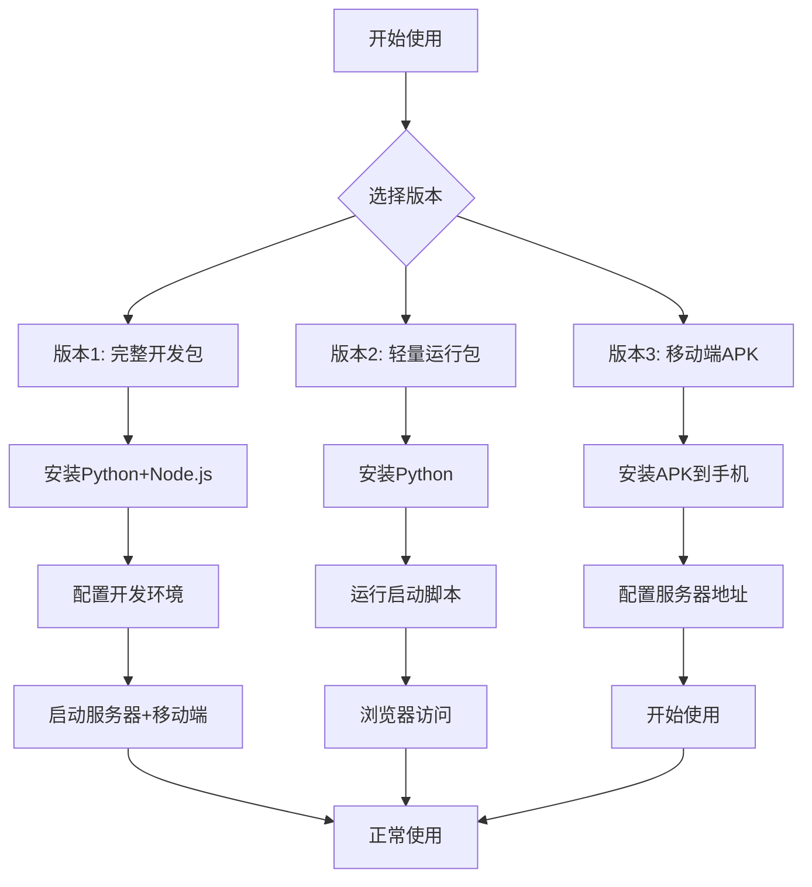

# 小灵同学看板系统 - 通用使用指南

## 系统架构

```
┌─────────────────┐    ┌─────────────────┐    ┌─────────────────┐
│   电脑服务器    │    │   手机客户端    │    │   数据存储      │
│   (Flask)       │◄──►│   (React Native)│    │   (JSON文件)    │
│   Port: 5000    │    │   Android/iOS   │    │                 │
└─────────────────┘    └─────────────────┘    └─────────────────┘
         ▲                       ▲                       ▲
         │                       │                       │
         └───────────────────────┴───────────────────────┘
                        局域网实时同步
```

## 快速开始流程图



## 详细步骤

### 第一步：准备工作
1. **确保电脑和手机在同一WiFi网络**
2. **获取电脑IP地址**：
   - Windows: `ipconfig` → 查看IPv4地址
   - Mac/Linux: `ifconfig` → 查看inet地址

### 第二步：启动服务器（电脑端）

#### 方法A：使用轻量运行包（推荐新手）
```bash
# 1. 进入version2_runtime目录
cd version2_runtime

# 2. Windows用户双击start_kanban.bat
# 3. 其他系统运行：python kanban_enhanced.py
```

#### 方法B：使用完整开发包
```bash
# 1. 安装Python依赖
pip install -r requirements.txt

# 2. 启动服务器
python kanban_enhanced.py
```

### 第三步：访问系统

#### 电脑访问
- 打开浏览器，访问：http://localhost:5000
- 或访问：http://[电脑IP地址]:5000

#### 手机访问（三种方式）

##### 方式1：浏览器访问（无需安装）
1. 打开手机浏览器（Chrome/Safari）
2. 输入：http://[电脑IP地址]:5000
3. 添加到主屏幕（获得类似APP的体验）

##### 方式2：安装APK（原生体验）
1. 安装version3_mobile_apk中的APK文件
2. 打开应用，配置服务器地址
3. 开始使用

##### 方式3：开发模式（需要环境）
1. 安装React Native开发环境
2. 运行移动端项目
3. 连接服务器使用

## 核心功能使用指南

### 1. 任务管理
```
创建任务 → 编辑任务 → 移动任务 → 完成任务
    ↓          ↓          ↓          ↓
设置标题     修改内容     拖拽排序     归档记录
设置标签     调整优先级  改变状态     查看历史
设置截止日期 添加评论     分配人员     导出数据
```

### 2. 标签系统
- **预定义标签**：紧急、重要、日常、长期、Bug、功能
- **自定义标签**：点击"+"添加新标签
- **标签筛选**：点击标签快速过滤相关任务
- **标签颜色**：不同颜色区分不同类型

### 3. 搜索过滤
- **关键词搜索**：在搜索框输入关键词
- **标签过滤**：点击标签筛选
- **状态过滤**：按任务状态筛选
- **组合搜索**：多种条件组合使用

### 4. 实时协作
- **多用户支持**：多人同时编辑
- **实时同步**：操作立即生效
- **操作记录**：查看历史活动
- **用户状态**：显示在线用户

## 小米15Pro优化功能

### 触摸优化
- **长按操作**：长按任务进行编辑
- **拖拽排序**：按住任务拖动到不同列
- **滑动操作**：左右滑动查看详情
- **手势支持**：双指缩放、滑动刷新

### 屏幕适配
- **响应式布局**：自动适应屏幕尺寸
- **字体优化**：适合阅读的字体大小
- **图标优化**：清晰易识别的图标
- **间距优化**：舒适的触摸间距

### 性能优化
- **快速加载**：减少等待时间
- **流畅动画**：平滑的过渡效果
- **省电模式**：优化电池使用
- **离线支持**：网络断开时仍可查看

## 高级功能

### 数据导入导出
```
导入 → 从Trello导入 → 自动转换 → 导入完成
导出 → 选择格式 → 生成文件 → 下载保存
      (JSON/CSV)
```

### 用户管理
1. **用户登录**：输入用户名即可登录
2. **角色权限**：管理员/普通用户
3. **会话管理**：自动保存登录状态
4. **活动记录**：查看用户操作历史

### 系统设置
- **服务器配置**：修改端口、主机地址
- **数据备份**：自动/手动备份
- **日志查看**：系统运行日志
- **系统状态**：查看服务器状态

## 故障排除

### 连接问题
```
症状：手机无法访问
检查：
1. ✅ 电脑防火墙是否允许端口5000
2. ✅ 手机和电脑是否同一WiFi
3. ✅ 电脑IP地址是否正确
4. ✅ 服务器是否正在运行
解决：
- Windows防火墙：允许Python通过防火墙
- 路由器设置：检查AP隔离设置
- 网络测试：ping电脑IP地址
```

### 性能问题
```
症状：系统运行缓慢
优化：
1. 🔧 清理浏览器缓存
2. 🔧 重启服务器
3. 🔧 减少同时打开的任务数
4. 🔧 升级电脑硬件配置
```

### 数据问题
```
症状：数据丢失或错误
恢复：
1. 💾 检查backups目录的备份文件
2. 💾 手动恢复数据
3. 💾 联系技术支持
预防：
- 定期导出数据备份
- 不要直接编辑数据文件
- 使用系统提供的导入导出功能
```

## 最佳实践

### 日常使用建议
1. **早上**：查看待办任务，规划一天工作
2. **工作中**：更新任务状态，添加进展
3. **会议中**：共享看板，讨论任务
4. **下班前**：整理完成的任务，规划明天

### 团队协作建议
1. **明确分工**：每人负责特定列或标签
2. **定期同步**：每天站会更新进展
3. **使用标签**：用标签区分任务类型
4. **添加评论**：重要讨论记录在任务中

### 数据管理建议
1. **每周备份**：导出数据到安全位置
2. **定期清理**：归档已完成的任务
3. **使用搜索**：快速找到需要的任务
4. **标签分类**：建立清晰的分类体系

## 技术支持

### 获取帮助
- **文档查询**：查看各版本的README文件
- **问题反馈**：记录问题现象和步骤
- **联系支持**：assistant@xiaoling.com
- **版本更新**：关注新版本发布

### 学习资源
- **视频教程**：系统使用演示视频
- **用户手册**：详细功能说明
- **示例数据**：预置的示例任务
- **社区支持**：用户交流群组

## 版本选择指南

### 版本1：完整开发包
**适合人群**：开发者、技术爱好者、需要定制功能
**包含内容**：源代码、移动端项目、开发文档
**使用场景**：二次开发、功能扩展、学习研究

### 版本2：轻量运行包
**适合人群**：普通用户、快速使用、无需开发
**包含内容**：可执行文件、启动脚本、使用指南
**使用场景**：日常使用、团队协作、快速部署

### 版本3：移动端APK
**适合人群**：手机用户、需要原生体验
**包含内容**：Android APK、安装指南、优化配置
**使用场景**：移动办公、外出使用、手机专属

---
**最后更新**：2026年2月13日
**系统版本**：v3.0 增强版
**技术支持**：小灵同学助理